# CTEF v0.3.2 — Substrate-and-Primitive Layering Figure

**Status:** Draft for review by @eriknewton (Concordia / Verascore / Sanctuary) per his offer on A2A #1725 (2026-05-13)
**Target:** ship into v0.3.2 publish announcement (May 19-22, 2026)
**Anchor:** Erik's two-tier substrate-and-primitive articulation on A2A #1725, refined with @aeoess's per-receipt-type attribution on #1786 (2026-05-12) and @jschoemaker's Envoys v1.5 §6/§4.3/§8.2 ship on #1829 (2026-05-13).

The figure has **three horizontal layers** because the substrate ↔ primitive distinction is the structural insight, but primitives need a runtime/aggregator layer that consumes them. Calling it "two-tier" preserves Erik's original framing of the primary cleavage (substrate vs. everything-above); the third layer is consequence, not co-equal.

---

## Mermaid diagram

```mermaid
flowchart TB
    %% ─── Layer 3: Runtimes / Aggregators ───
    subgraph L3["🔷 Runtimes & Aggregators &nbsp;(consume primitives → produce verdicts / scores)"]
        Sanctuary["Sanctuary Framework<br/><i>sovereignty enforcement</i>"]
        Verascore["Verascore<br/><i>reputation aggregation</i>"]
        AgentGraph["AgentGraph<br/><i>composite trust score</i>"]
        ArkForge["ArkForge Trust Layer<br/><i>enforcement gateway</i>"]
    end

    %% ─── Layer 2: Primitives ───
    subgraph L2["🔶 Primitives &nbsp;(domain-specific attestations, signed with substrate wire format)"]
        direction TB
        Identity["CTEF claim_type: identity<br/>+ AgentID + A2A-IDF #1496"]
        Authority["CTEF claim_type: authority<br/>+ APS delegation_receipt<br/>+ Concordia mandate"]
        Continuity["CTEF claim_type: continuity<br/>+ APS rotation-attestation<br/>+ HiveTrust session_epoch"]
        Concordia["Concordia v0.5.1<br/>{receipt, chain_session, predicate, mandate}"]
        ERC8004["ERC-8004<br/>{Identity, Reputation, Validation} on-chain"]
        Nobulex["Nobulex bilateral_receipt<br/>(covenant_binding, payment_execution)"]
    end

    %% ─── Layer 1: Substrate (Wire Format) ───
    subgraph L1["⬛ Substrate &nbsp;(wire format + canonicalization — byte-identical across implementations)"]
        direction LR
        Envoys["Envoys signature/v1 §4 §6 §8<br/>RFC 9421 + dual-shape keyid<br/>+ tag parameter + SHA-512 promote"]
        CTEF["CTEF v0.3.1 envelope<br/>JCS canonical + Ed25519 JWS<br/>closed {identity,transport,authority,continuity}"]
    end

    %% ─── Composition arrows: substrate carries primitives ───
    Envoys -.->|carries| Identity
    Envoys -.->|carries| Authority
    Envoys -.->|carries| Continuity
    CTEF -.->|embeds| Identity
    CTEF -.->|embeds| Authority
    CTEF -.->|embeds| Continuity

    %% ─── Primitives compose with each other (URN cross-references) ───
    Concordia -.->|urn:concordia:attestation:| Authority
    ERC8004 -.->|urn:erc8004:reputation:| AgentGraph
    Nobulex -.->|covenant_binding| Authority

    %% ─── Primitives flow up to runtimes ───
    Identity --> Sanctuary
    Identity --> AgentGraph
    Authority --> ArkForge
    Authority --> Verascore
    Continuity --> AgentGraph
    Continuity --> Sanctuary
    Concordia --> Verascore
    ERC8004 --> Verascore
    Nobulex --> Verascore

    classDef substrate fill:#1a1a2e,stroke:#0a84ff,color:#fff
    classDef primitive fill:#16213e,stroke:#e879f9,color:#fff
    classDef runtime fill:#0f3460,stroke:#2dd4bf,color:#fff
    class Envoys,CTEF substrate
    class Identity,Authority,Continuity,Concordia,ERC8004,Nobulex primitive
    class Sanctuary,Verascore,AgentGraph,ArkForge runtime
```

---

## Tier-by-tier layer table (review checkpoint)

### Layer 1 — Substrate (wire format + canonicalization)

| Component | Spec | Role | Conformance anchor |
|---|---|---|---|
| **CTEF v0.3.1 envelope** | `agentgraph-co/agentgraph@69ad94d` | Embedded `claim_type` attestation; JCS canonical (RFC 8785); Ed25519 JWS (RFC 7515); closed claim_type set `{identity, transport, authority, continuity}` | `/.well-known/cte-test-vectors.json` (live), **10 byte-match validated implementations** (AgentGraph, APS, AgentID, @nobulex/crypto, HiveTrust, ArkForge, msaleme, Foxbook, Agent Community Verifiability Gate, AlgoVoi), 7+ canonicalizers across Py/TS |
| **Envoys signature/v1 v1.5** | `envoys.me/specs/signature/v1` (commit `85c63b3`) | Wire-level HTTP signature; RFC 9421; §6 dual-shape keyid resolution (`application/did+json` W3C DID Document per §6.1 / Envoys-native per §6.2); §4.3 OPTIONAL tag parameter — *generic slot, values profiled by callers* (back-compat absent ≡ `a2a-message`); §4.2 + §5.3 SHA-512 acceptance with sender auto-promote at ≥4096 bytes | §14 Vectors 1-3 byte-stable across 1.4.0→1.5.0; **section numbers stable across v1.x** per jschoemaker on #1829 (2026-05-13); **conformance suite:** `envoys-rfc9421` (`jschoemaker/Envoys-public`), 9 vectors (6 positive + 3 negative) pinned to v1.5 against RFC 8032 §7.1 keypair; independently byte-matched by `aeoess/aps-conformance-suite@c16aa04` and AIM `aim-did-rfc9421` |

**Substrate composition rule:** Envoys handles the wire-signature layer (HTTP message canonicalization + Ed25519 signature). CTEF supplies the embedded claim_type attestation that travels inside the signed message body. Both share JCS canonicalization at the byte level, so the same canonical bytes verify under either §6.1 (DID Document) or §6.2 (Envoys-native) keyid resolution.

**Tag parameter profile rule** (per jschoemaker on #1829, 2026-05-13): Envoys §4.3 defines the tag parameter as a **generic slot** — Envoys does not enumerate valid tag values. CTEF v0.3.2 profiles the slot by adopting the four-value convention `tag ∈ {identity, transport, authority, continuity}` matching the closed `claim_type` set. This mirrors the same separation as RFC 9421 itself: 9421 defines `keyid` as a generic slot; Envoys §6 and did:web each profile their own URL forms for it. No Envoys spec change is required to support the CTEF tag profile. The four-value tag convention is a CTEF v0.3.2 normative addition, not an Envoys v1.5 addition.

### Layer 2 — Primitives (domain-specific attestations)

| Primitive | Anchor | claim_type slot | Where it composes |
|---|---|---|---|
| **AgentID** (Harold Frimpong) | A2A-IDF #1496 + `opena2a-org/a2a-idf-sdk` + `opena2a-org/a2a-idf-conformance` | `identity` | DID resolution + JWKS dispatch |
| **Concordia v0.5.1** (Erik Newton) | `concordia-protocol@v0.5.1` + SPEC §11.5 | `authority` (via `mandate` type — `concordia.models.mandate` ships standalone primitive; `predicate` is reference-slot-only in v0.5.1, full predicate artifact deferred to v0.5.2 / v0.6) | URN: `urn:concordia:attestation:<id>` |
| **APS delegation_receipt** (aeoess) | `aps-conformance-suite` bilateral-delegation 10 vectors | `authority` | Scope-narrowing delegation chain |
| **APS rotation-attestation** (aeoess) | `aps-conformance-suite` rotation 5 vectors | `continuity` | Key rotation + replay-window |
| **APS bilateral_receipt** (aeoess) | Envoys §4.3 tag parameter | **envelope/wire** (per #1786 + Envoys §8.2 refinement) | Wire-layer attribution; not a primitive in the same sense |
| **HiveTrust session_epoch + HAHS** (Steve Rotzin) | v0.3.2 contribution | `continuity` | Long-session continuity |
| **Nobulex bilateral_receipt** (Arian Gogani) | `@nobulex/crypto` + AAIF #20 + Trust Capital module | `authority` (via `covenant_binding`) + `evidence_basis` (via `payment_execution`) | Trust Capital tier-upgrade flow |
| **ERC-8004** (Erik Reppel + co-authors) | Ethereum mainnet 2026-01-29 — Layer 2 primitives over an alternate execution substrate (Ethereum / L2), not a Layer 1' addition | Three registries → three evidence dimensions for Layer 3 aggregation: Identity → identity-class evidence, Reputation → composite-history evidence, Validation → verified-work evidence. Different scoring profiles weight them differently | URN: `urn:erc8004:identity:<entry_id>` / `urn:erc8004:reputation:<entry_id>` / `urn:erc8004:validation:<entry_id>` |
| **ArkForge constraint_evaluation** (desiorac) | `qntm#7` PR #14 | `evidence_basis` (within-limit, near-miss, exceeded) | Enforcement-gateway role (also Layer 3) |
| **Foxbook did:foxbook:** (cloakmaster) | `canonicalize@2.1.0` (erdtman) | `identity` (alternative DID method) | Identity-layer evidence_provider |

**Per-receipt-type attribution rule** (aeoess #1786 + Envoys §8.2 + Erik confirmed on #1725, 2026-05-12/13):
> The protocol spans layers; the receipts are what should be attributed.
- APS `bilateral_receipt` → wire/envelope (signed HTTP message itself); no tag on the wire, interpreted as `tag="a2a-message"` by a v1.5 verifier per §4.3 back-compat
- APS `delegation_receipt` → authority primitive
- APS `rotation-attestation` → continuity primitive

**Two-scope reference rule** (Concordia v0.5.1 enforces in code per Erik on #1725, 2026-05-13): envelope-level references and attestation-level references are two separate surfaces with distinct shapes, mandated distinct by SPEC §11.5:
- **Envelope-level references** carry `{kind, urn, verified_at, verifier_did, hash}` — cryptographic provenance
- **Attestation-level references** carry `{type, id, relationship}` — semantic content

The receipt-type-determines-layer rule (Layering Rule 4 below) is the lookup mechanism; the two-scope structure is the implementation pattern that prevents cross-scope contamination.

### Layer 3 — Runtimes / Aggregators / Evidence Producers (single horizontal layer, multiple roles per project)

Per Erik on #1725 (2026-05-13): Layer 3 stays one horizontal layer. **Runtime, aggregator, and evidence-producer are distinct roles within Layer 3**, often played by the same project on different artifacts. Role labels disambiguate which artifact-shape a project produces at a given moment.

| Layer 3 component | Primary role | Secondary roles | Anchor | Cross-protocol input shape |
|---|---|---|---|---|
| **Sanctuary Framework** (Erik Newton) | runtime / enforcement (kernel-level egress filter at OS boundary + cooperative Charter surface) | evidence producer (sovereignty health report re-enters Layer 2 as attestation) | `sanctuary-framework` | Identity + continuity primitives |
| **Verascore** (Erik Newton) | aggregator / accountability (multi-source evidence ingest, scoring with adversarial weighting) | consumes Sanctuary-emitted evidence attestations | `verascore` | All primitives via URN cross-references; weights ERC-8004 Identity / Reputation / Validation differently per scoring profile |
| **AgentGraph composite trust score** | aggregator (composite ingest with provider-reliability weighting) | evidence producer (composite-score attestation re-enters Layer 2) | `EXTERNAL: 0.35` weight in `src/trust/score.py` | Consumes CTEF + ERC-8004 + Concordia + Nobulex attestations via URN-shaped references |
| **ArkForge Trust Layer** (desiorac) | runtime / enforcement-gateway (constraint_evaluation → permit/deny verdict) | evidence producer (enforcement-decision attestation re-enters Layer 2) | `trust.arkforge.tech` | Authority + evidence_basis primitives |

**Runtime composition rule:** Layer 3 components MUST NOT introduce new wire formats or canonicalization schemes. They consume primitive attestations (already JCS-canonical + Ed25519-signed at the substrate layer) and produce verdicts, scores, or enforcement decisions. Layer 3 components that emit attestations of their own (Sanctuary sovereignty health reports, AgentGraph composite scores, ArkForge enforcement decisions) re-enter Layer 2 as primitives in their own right — the role taxonomy (runtime / aggregator / evidence-producer) governs which artifact shape a Layer 3 component produces at a given moment, but layer placement stays singular.

---

## URN-shaped cross-protocol references (per Concordia v0.5.1 §11.5.7)

Cross-protocol pointers are URN-shaped — no translation layer, byte-comparable, namespace-segregated:

| URN scheme | Target | Used by |
|---|---|---|
| `urn:concordia:attestation:<id>` | Concordia receipt / chain_session / predicate / mandate | All Layer 2 primitives that reference Concordia attestations |
| `urn:erc8004:reputation:<entry_id>` | ERC-8004 on-chain reputation registry entry | AgentGraph composite score + Verascore reputation aggregation |
| `urn:erc8004:identity:<entry_id>` | ERC-8004 on-chain identity registry entry | AgentID + Concordia mandate issuance |
| `urn:erc8004:validation:<entry_id>` | ERC-8004 on-chain validation registry entry | Verascore + Sanctuary |
| `urn:a2a:task:<task_id>` | A2A message / task ID | All primitives in A2A-mediated flows |
| `urn:ap2:<scheme>` | AP2 (parallel scheme per §11.5.7) | Forward-compat slot |
| `urn:x402:<scheme>` | x402 (parallel scheme per §11.5.7) | Coinbase x402 endpoint references |

Concordia v0.5.1 attestation-level references have shape `{id, type, relationship}` with:
- `type ∈ {receipt, chain_session, predicate, mandate}`
- `relationship ∈ {supersedes, extends, fulfills, references}`

Profile-level extension (Erik + @A2CN + @BidAngel, forward-compat per §11.5.5): wider cross-protocol set `{fulfills, approves, enforces, rejects, satisfies}` lands in v0.3.3 envelope-shape diff, not v0.3.2.

---

## Layering precision rules (Erik review checkpoints)

These are the invariants the figure asserts. Each is checkable against the diagram and tables above.

1. **Substrate layer (1) is wire-format-only.** Anything that introduces new domain semantics is not substrate. Envoys + CTEF qualify; Concordia + APS do not (they carry domain semantics in their attestation payloads).

2. **Primitives (2) cannot leak across the substrate layer.** A primitive that has its own wire format violates the layering. ERC-8004's on-chain registry entries are primitives because their *payload* is a domain attestation; the *transport* is Ethereum mainnet (an alternate substrate, not a CTEF/Envoys substrate addition).

3. **Runtimes (3) cannot define new wire formats.** AgentGraph emitting a composite-score attestation re-enters Layer 2; the attestation MUST be JCS-canonical + Ed25519-signed per CTEF v0.3.1 / Envoys v1.5 substrate.

4. **Per-receipt-type attribution is the lookup mechanism.** A receipt's layer is determined by its *receipt type*, not the protocol it belongs to. `bilateral_receipt` at wire/envelope, `delegation_receipt` at authority, `rotation-attestation` at continuity — regardless of whether they originate from APS or Nobulex or a future-named protocol.

5. **URN-shaped references are the only cross-layer pointer.** No primitive embeds another primitive's full attestation; cross-references use URN-shaped ID-only pointers. This preserves substrate isolation — verifiers don't need to resolve all referenced attestations to verify the local signature.

6. **Closed claim_type set at substrate layer.** `{identity, transport, authority, continuity}` is fixed at v0.3.1. New attestation domains use `claim_subtype` inside the existing types. This is enforced via canonicalization byte-match (any new top-level type would produce a different canonical envelope shape and fail conformance).

7. **Profile-level extensions live above the layering, not inside it.** Erik + @A2CN + @BidAngel's `{fulfills, approves, enforces, rejects, satisfies}` relationship set is a profile on top of Layer 2 attestations, not a Layer 1 extension. Forward-compat per Concordia §11.5.5 (unknown relationship values preserved as opaque strings).

---

## Open questions — all 5 resolved as of draft 1.2

1. ~~Is the per-receipt-type attribution allocation correct?~~ **Resolved per Erik on #1725 (2026-05-13):** allocation confirmed (bilateral_receipt at wire/envelope, delegation_receipt at authority, rotation-attestation at continuity). Layering Rule 4 (receipt type determines layer) is the right framing. Concordia v0.5.1 already enforces the two-scope separation in code: envelope-level references carry `{kind, urn, verified_at, verifier_did, hash}` (cryptographic provenance), attestation-level references carry `{type, id, relationship}` (semantic content), with SPEC §11.5 mandating the surfaces stay distinct.

2. ~~Are ERC-8004 registries primitives (Layer 2) or alternate substrate?~~ **Resolved per Erik on #1725 (2026-05-13):** Layer 2 primitives **over an alternate execution substrate**. Ethereum (or an L2) is the alternate substrate; Identity, Reputation, and Validation entries are domain primitives addressable through Concordia via `urn:erc8004:*` pointers. No Layer 1' line needed. The three registries map to three different evidence dimensions for Layer 3 aggregation (Identity / Reputation / Validation → identity-class / composite-history / verified-work evidence) — different scoring profiles weight them differently. Folded into Layer 2 row + Layer 3 role-label table.

3. ~~Where does Concordia v0.5.1's `predicate` type slot in?~~ **Resolved per Erik on #1725 (2026-05-13):** authority-subtype mapping under CTEF `claim_type: authority` when the predicate evaluates authority, scope, policy, or bounds. The closed CTEF claim_type set should NOT expand to add predicate; the subtype pattern handles it. Specific subtype string is CTEF v0.3.2's call. **Precision correction:** Concordia v0.5.1 ships the predicate reference slot (`REFERENCE_TYPES` includes predicate; SPEC §11.5 structural validation passes it through) but does not yet ship a standalone predicate model comparable to `concordia.models.mandate`. Full predicate artifact is a v0.5.2 or v0.6 commitment. Treating predicate as authority-subtype mapping rather than as a shipped CTEF-native primitive keeps the figure honest. URN cross-referencing via `urn:concordia:attestation:` per §11.5.7 already works for predicate references today.

4. ~~Should `bilateral_receipt` carry tag value `bilateral-receipt` (per Envoys §4.3) or stay absent (defaulting to `a2a-message` per back-compat)?~~ **Resolved per jschoemaker on #1829 (2026-05-13):** Envoys §4.3 defines the tag parameter as a generic slot without enumerating values; CTEF v0.3.2 profiles the slot with the four-value convention `tag ∈ {identity, transport, authority, continuity}` matching the closed `claim_type` set. `bilateral_receipt` (envelope-attributed per Envoys §8.2) does not carry an additional tag; no tag on the wire, interpreted as `tag="a2a-message"` by a v1.5 verifier per §4.3 back-compat. Explicit four-value tagging applies to CTEF embedded-attestation signatures, not to the bilateral_receipt itself.

5. ~~Is the Layer 3 runtime-vs-aggregator distinction necessary?~~ **Resolved per Erik on #1725 (2026-05-13):** don't split the visual; split the role labels. Layer 3 stays one horizontal layer; runtime, aggregator, and evidence-producer are distinct roles within it, often played by the same project on different artifacts. Concrete example: Sanctuary is runtime/enforcement (kernel-level egress filter + cooperative Charter surface) but also evidence-producer (sovereignty health report re-enters Layer 2); Verascore is aggregator/accountability (multi-source evidence ingest + scoring with adversarial weighting). Roles compose; layer stays one. Folded into Layer 3 role-label table.

4. ~~Should `bilateral_receipt` carry tag value `bilateral-receipt` (per Envoys §4.3) or stay absent (defaulting to `a2a-message` per back-compat)?~~ **Resolved per jschoemaker on #1829 (2026-05-13):** Envoys §4.3 defines the tag parameter as a generic slot without enumerating values; CTEF v0.3.2 profiles the slot with the four-value convention `tag ∈ {identity, transport, authority, continuity}` matching the closed `claim_type` set. `bilateral_receipt` (envelope-attributed per Envoys §8.2) does not carry an additional tag; it is a wire-layer receipt and uses the back-compat default-absent shape. Explicit four-value tagging applies to CTEF embedded-attestation signatures, not to the bilateral_receipt itself.

5. **Is the Layer 3 runtime-vs-aggregator distinction necessary?** I've grouped them together because both consume primitives and produce something domain-specific. Separating them (runtime: per-request enforcement; aggregator: cross-request scoring) might clarify Sanctuary vs. Verascore vs. AgentGraph slots — but adds visual complexity.

---

## Status

- **Draft 1:** 2026-05-13 (commit `6cf9231`) — posted for @eriknewton review
- **Draft 1.1:** 2026-05-13 (commit `64a6760`) — folded jschoemaker first-pass corrections from #1829: (a) Envoys §4.3 tag parameter is a generic slot, CTEF v0.3.2 profiles the four-value convention on top; (b) Envoys §4.3/§6/§8.2/§14 section numbers stable across v1.x point releases — citations pinning-safe. Open Question #4 resolved.
- **Draft 1.2:** 2026-05-13 (commit `23db801`) — folded @eriknewton per-question pass on #1725 (Q1/Q2/Q3/Q5 all resolved with Concordia v0.5.1 two-scope reference rule + predicate precision correction + ERC-8004 evidence-class refinement + Layer 3 role-label refinement) plus jschoemaker second-pass corrections on #1829 (DID Document terminology + ≥4096 bytes literal + spelled-out tag-absence phrasing). **All 5 open questions resolved.**
- **Draft 1.3:** 2026-05-14 (commit `9c777ba`) — jschoemaker third-pass precision on #1829: canonical Envoys conformance suite is `envoys-rfc9421` at `jschoemaker/Envoys-public` (9 vectors: 6 positive + 3 negative) pinned to v1.5 against RFC 8032 §7.1 keypair; `aeoess/aps-conformance-suite@c16aa04` is an independent byte-match of one vector, not the canonical suite. AIM `aim-did-rfc9421` also independently byte-matches. **Envoys-side review closed — figure publish-ready from both Erik (#1725) + jschoemaker (#1829) sides.**
- **Draft 1.4:** 2026-05-18 — §3.8 set expanded from 8 to **10 byte-match validated implementations** during launch week. Two new entries ratified:
  - **9th — Agent Community Verifiability Gate** (Liuyanfeng) — cite ratified May 15 after 4-iteration substrate-filter cycle; receipt at `gist.github.com/Liuyanfeng1234/82da951b5b94a019468f4ccaf35164ad`; 14/14 byte-match (CTEF v0.3.1 4/4 + APS JCS canonicalization conformance 10/10) reproducible from fresh clone via `python3 verify.py`. Python `json.dumps(sort_keys + separators + ensure_ascii=False)` + integer-float normalization.
  - **10th — AlgoVoi** (chopmob-cloud) — cite ratified May 16 first-attempt; receipt at `gist.github.com/chopmob-cloud/5f35eaa527d292bf3ddc52f8725a85c9`; 14/14 byte-match reproducible from fresh clone via `pip install rfc8785 && python3 verify.py`. Uses upstream `rfc8785 v0.1.4` library via `shared/utils/jcs_canonical.py` wrapper. Production deployment at `did:web:api.algovoi.co.uk` carrying A2AAgent + X402PaymentGateway service endpoints off one DID + one signing key material.
- **Review window:** May 13-19 (Erik per-question pass closed 2026-05-13; jschoemaker corrections closed 2026-05-14; §3.8 set expansion closed 2026-05-16). Ready for v0.3.2 publish announcement May 19-22.
- **Publish target:** v0.3.2 announcement, May 19-22 (figure embedded in announcement post + cited in v0.3.2 publish notes)

PRs welcome from any of the named primitive/runtime maintainers to refine their layer placement or add cross-protocol annotations.
